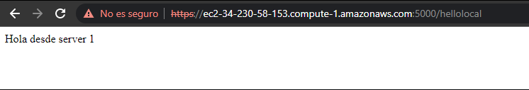

# Spark web application with https
This repository includes code to deploy a basic spark application to AWS, it is builded with Apache Spark, html and contains ssl certificates for https protocol.

## Architecture

This spark application uses an architecture that has 2 components:
- Server:
two spark web application that communicates bewteen them by https


## Usage
first you´ll need to export some enviroment variables to compile the app:
```
KEYSTORE: path to the keystore
KEYTRUST: path to the other server keytrust
PASSWORD: password of the keystore
SERVICEPORT: the other server spark app port
PORT: the port for this server
MESSAGE: the message to display from this server
```
then you'll have to deploy an instance in AWS ec2 service, after that you'll have to clone the code and compile with:

```
mvn clean install
```

after that you'll have to run the spark web application with:
```
java -cp target/classes:target/dependency/* edu.eci.aep.SparkWeb
```
and then the application will be running

## examples 

this is an example of the project running in two aws instances
Server 1


Server2

